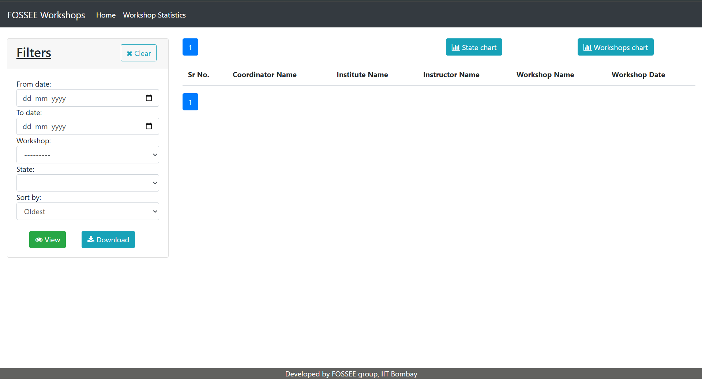
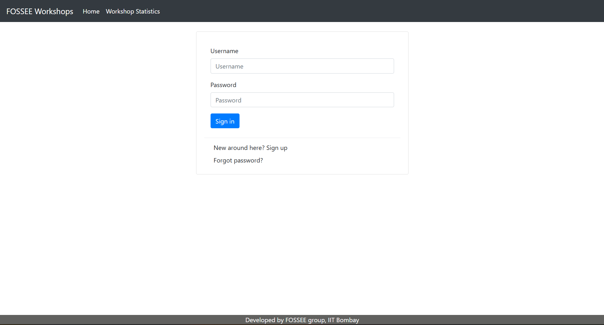
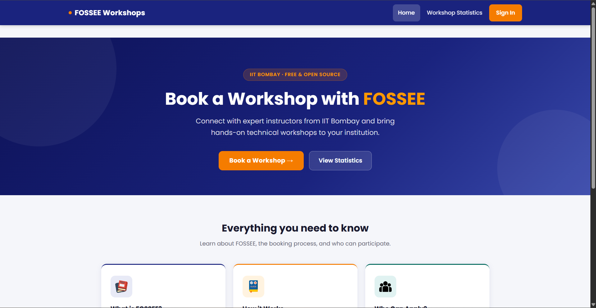
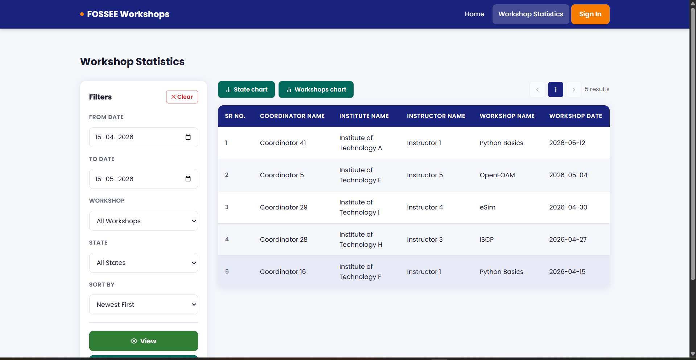
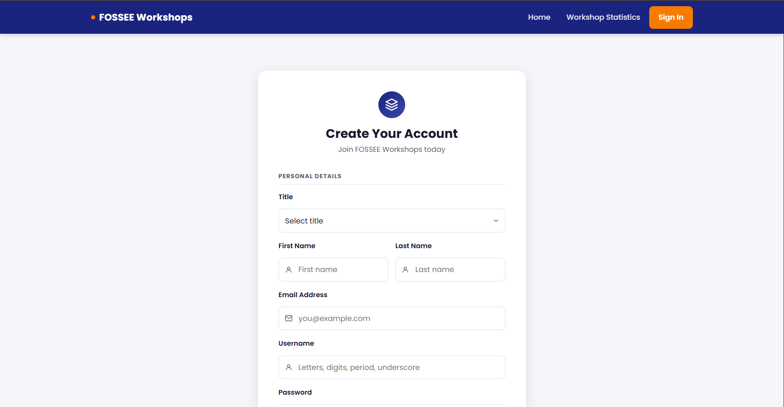
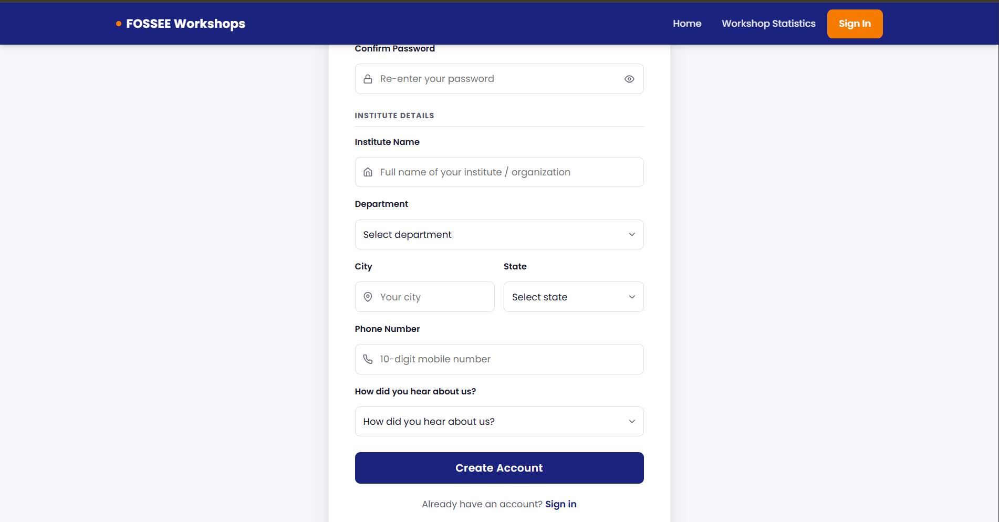
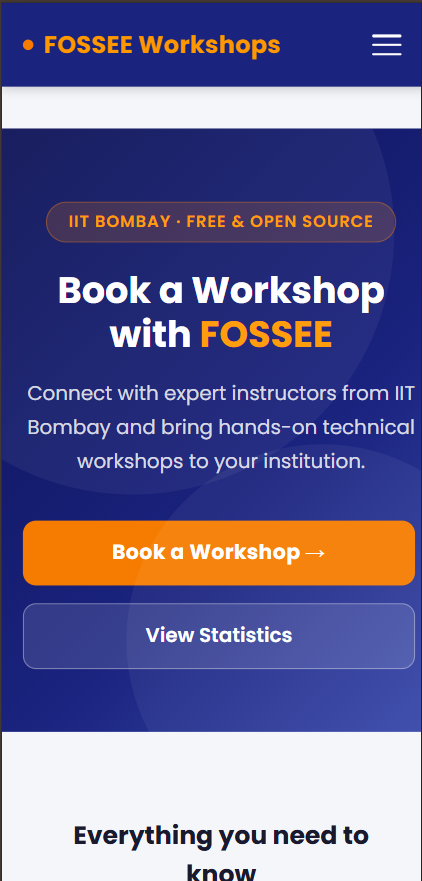
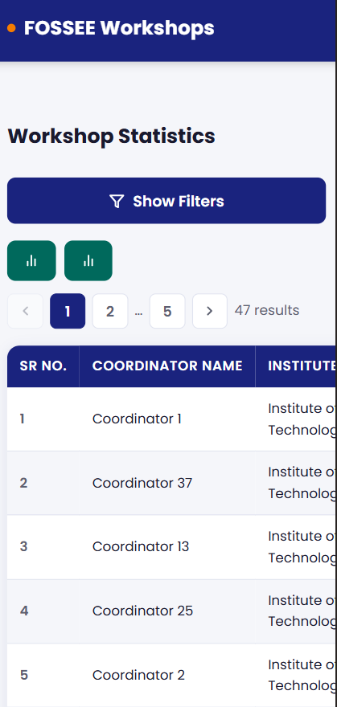
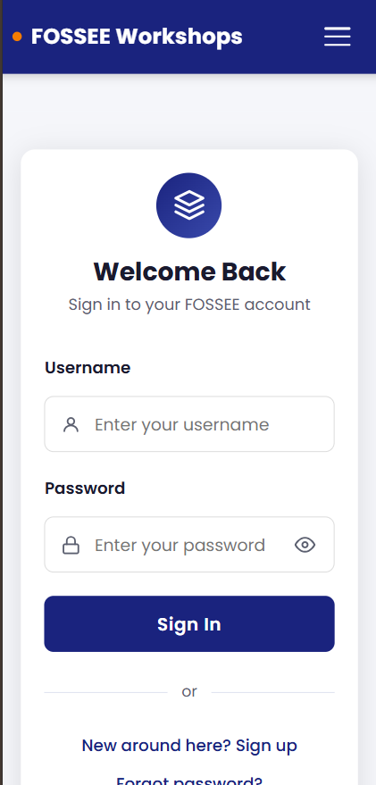

# Workshop Booking — FOSSEE, IIT Bombay

> A web application for coordinators to book FOSSEE workshops. Coordinators can register, browse available workshops, and propose a workshop date. Instructors from IIT Bombay review and confirm the bookings.

---

## UI Redesign

Full frontend redesign built with **React + Vite**, replacing the original Django templates with a modern, mobile-first UI.

---

## Visual Showcase

> Before and after UI improvements are shown below for comparison.

### Before UI

**Booking Page**



**Signup Page**



---

### After UI

**Home Page**



**Booking / Statistics Page**



**Signup Page — Part 1**



**Signup Page — Part 2**



---

### Mobile View

**Home Page**



**Booking Page**



**Signup Page**



---

## Tech Stack

| Layer    | Technology                      |
|----------|---------------------------------|
| Backend  | Django 3.0.7, SQLite            |
| Frontend | React 18, Vite, plain CSS       |
| Fonts    | Poppins (Google Fonts)          |
| Routing  | React Router v6                 |
| SEO      | react-helmet-async              |

---

## Pages

| Route         | Page                |
|---------------|---------------------|
| `/`           | Home                |
| `/login`      | Login               |
| `/register`   | Register / Sign Up  |
| `/statistics` | Workshop Statistics |

---

## Features

- Mobile-first responsive design
- Accessible — ARIA labels, visible focus rings, semantic HTML
- Workshop statistics with date, state, and type filters
- CSV download of filtered workshop data
- State-wise and type-wise bar charts
- Password strength indicator on signup
- Show/hide password toggle

---

## Reasoning

### What design principles guided your improvements?

The redesign was guided by simplicity, clarity, and consistency. A clean and minimal layout was used to improve readability and reduce user confusion. Visual hierarchy was enhanced using proper spacing, typography, and alignment so that important elements like forms and buttons stand out clearly. Consistent color schemes and reusable components were maintained across all pages to provide a uniform and intuitive user experience.

---

### How did you ensure responsiveness across devices?

A mobile-first approach was followed since the primary users are students accessing the website on mobile devices. Flexible layouts using CSS Flexbox and Grid were used to adapt to different screen sizes. Media queries were applied to adjust layout, spacing, and font sizes for mobile, tablet, and desktop views. The application was tested using browser developer tools to ensure smooth functionality across different devices.

---

### What trade-offs did you make between the design and performance?

To maintain performance, heavy UI libraries and complex animations were avoided. Instead, lightweight CSS and simple design elements were used to ensure faster loading and smoother interactions. While advanced visual effects could improve appearance, priority was given to usability and performance to provide a better user experience.

---

### What was the most challenging part of the task and how did you approach it?

The most challenging part was converting the existing basic interface into a modern React-based UI while preserving the original functionality. Ensuring responsiveness across different devices without breaking the layout was also difficult. This was handled by breaking the UI into reusable components and testing each part individually. Iterative improvements and continuous testing helped in achieving a stable and user-friendly design.

---

## Quick Start

```bash
# Backend
pip install -r requirements.txt
python manage.py makemigrations
python manage.py migrate
python manage.py createsuperuser
python manage.py runserver

# Frontend (separate terminal)
cd frontend
npm install
npm run dev
```

- Django → `http://localhost:8000`
- React → `http://localhost:5173`

---

## Project Structure

```
workshop_booking/
├── frontend/            # React + Vite app
│   └── src/
│       ├── components/  # Navbar, Footer, Layout
│       ├── pages/       # HomePage, LoginPage, RegisterPage, StatisticsPage
│       └── styles/      # Per-page CSS files
├── workshop_app/        # Django app — models, views, forms
├── statistics_app/      # Django app — workshop statistics
├── workshop_portal/     # Django project settings and URLs
├── docs/                # Setup guide
├── screenshots/         # Before/After UI screenshots
└── requirements.txt
```

---

Developed by **FOSSEE group, IIT Bombay**
